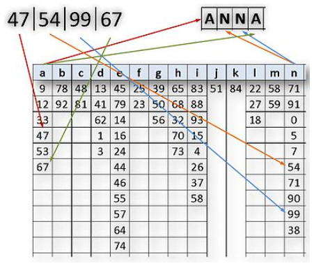

# encrypts

Encryption algorithms made up to work in console. You need to have python installed. https://www.python.org/downloads/

## Homophonic encryption
As with all monoalphabetic substitution methods, only a single, fixed substitution alphabet is used for encryption and decryption in homophonic encryption.
Everytime starting index.py the following steps occur:
  - Getting your input
  - Generating list A of integers from 0-99
  - Randomly assign intergers from A dependent on the probability of occurence of letters of the chosen possible language
  - Output your encrypted string
### Getting started
  - `git clone https://github.com/MaRcR11/encrypts`
  - `cd encrypts\homophonic-encryption`
  - `index.py {INPUT} {options}`
    - options
      - -e -> English language
      - -d -> German language
      - default is German

## atbash
Atbash is a monoalphabetic substitution cipher originally used to encrypt the Hebrew alphabet. It can be modified for use with any known writing system with a standard collating order.
Everytime starting index.py the following steps occur:
  - Getting your input
  - Assign cipher to each char
  - Output your encrypted string
### Getting started
  - `git clone https://github.com/MaRcR11/encrypts`
  - `cd encrypts\atbash`
  - `index.py {INPUT}`
      

## Note

Not finished, still in process.
